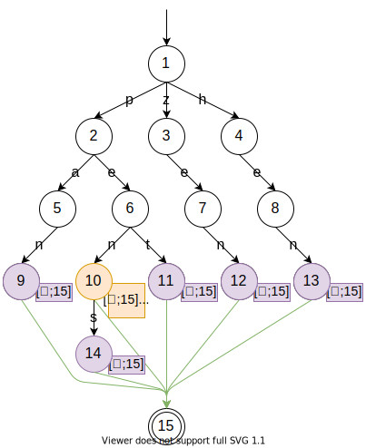
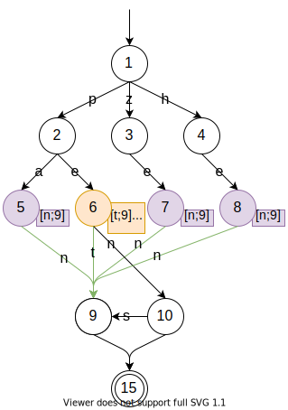

This document aims to describe how to turn a list of predefined words into a reasonably optimized regular expression matching exactly those words. The described method is explained using plain text and illustrations. No code will be shown, but a C# implementation exists in this project if you want to check it out for reference.

Given a list of words:
```text
pan
pen
pens
pet
zen
hen
```
how do you generate a regular expression that matches exactly those words and nothing else?

The naive solution is to put all words in one big alternation:
```regexp
pan|pen|pens|pet|zen|hen
```
This works, but potentially produces a very long and slow regular expression. A human that has experience with regular expressions may come up with something like this after a bit of manual tinkering:
```regexp
pe(ns?|t)|([hz]e|pa)n
```
In fact, this is what the finished algorithm will produce. At a first glance this looks hardly any better. For this minimal example it is only a tiny bit shorter, but because common prefixes and suffixes are factored out the regex engine matching this regex against a string has to do significantly less backtracking. For larger sets of words this becomes increasingly important to retain good performance. 

To generate such a regular expression we'll be diving into a bit of automata theory. I'll try to explain the relevant concepts as I go along, but if you feel overwhelmed by technical terms or diagrams, consider familiarizing yourself with the basics of automata theory first.

## prefix tree

The first optimization is to factor out common prefixes.
This can be achieved by constructing a [Trie or Prefix Tree](https://en.wikipedia.org/wiki/Trie).
Essentially we're using the list of possible words to build a tree that descends one character at a time:


Checking whether a word is in our list of accepted words is done by traversing the tree character by character, following the edge corresponding to the current character. If either no edge for the current character exists, or the word to check has ended and we're not stopped on an end state (marked through a double border), the word is not on our list of accepted words.

For example the word "pit" would start at the initial state, then traverse the `p`-edge to the `p`-state, but then fail to find an edge labelled `i`. Checking "pe" would successfully traverse the `p`-edge followed by the `e`-edge, but the `pe`-state is not marked as an end state. Both "pit" and "pe" are therefore rejected.

To be a bit more formal, the list of words we accept forms a finite language, that is a language with a finite amount of words. All finite languages are formally know to also be "regular languages". This is also how we know that it can be expressed through a regular expression.

Looking at the prefix tree you may notice that common prefixes, for example the "pe" in "pen" and "pet", are no longer duplicated. But common suffixes like "en" in "zen" and "hen" _are_ still duplicated. We will fix that now by "zipping" the common suffixes together from the bottom so to speak.

If you're familiar with automata theory you may have noticed that the syntax I chose to express the prefix tree already makes it look like an automaton. This is deliberate, because we are going to treat it exactly as such for the following steps. The kind of automaton we've built is a [deterministic acyclic finite state automaton](https://en.wikipedia.org/wiki/Deterministic_acyclic_finite_state_automaton), or DAFSA for short. "Deterministic" because during traversal there is never any ambiguity over what edge to follow. "Acyclic" because a state is never traversed more than once. "Finite State" because we have a finite amount of states.

Now that our language is expressed as a deterministic finite state automaton, we are able to perform something called [minimization](https://en.wikipedia.org/wiki/DFA_minimization). This means finding an automaton with the fewest possible states that describes the same language. There are several off-the-shelf minimization algorithms that can do this, but we'll use the fact that we start off with a tree to implement a simplified minimization algorithm.

## minimization

We want to minimize the existing trie-like automaton. To do this, we must eliminate all equivalent states. Before we start with the actual minimization, let's perform two transformations:
- Replace labels on states with numbers. The labels used to unambiguously describe the traversal path that was taken to reach that state. We do not need that information, and once we are merging equivalent states there will be multiple paths to some states anyway. I chose to simply number them to still be able to refer to them in text.
- Reduce the amount of end states to one by introducing and end-of-word edge (shown as unlabelled) from each end state to a new state. Make that new state the only end state.


With the newly created and only end state at hand, we'll use it as the starting point for recursive minimization.

In words, for the current node do the following: Merge all parent nodes that have an equal set of outgoing edges, where an edge is equal if it has the same label and transitions into the same node.



I've colored the edges from the currently processed node (15) to its parents green. Within those edges we can see two equivalence groups: 
- States 9, 11, 12, 13 and 14 whose transitions all solely consist of end-of-word transitioning into 15. These are colored purple.
- State 10 also has an end-of-word transition into 15, but additionally has a transition on "s" into 14, which makes state 10 _not_ be equivalent to the rest. It is colored orange.

State 10 will not be changed, since its equivalence group only has one state: itself. States 9, 11, 12, 13 and 14 however are all equivalent and can be collapsed into one state. We'll chose the first state (9) as the survivor and eliminate the rest. To eliminate a state, we need to reroute all of _its_ incoming edges to the survivor. After eliminating states 11, 12, 13 and 14 (and moving states around a bit to keep the illustration somewhat sane) the automaton looks like this:


And that's already it! We can now consider state 15 to be done and continue further up the tree recursively for all parents, namely state 9 and 10. Let's do it again for state 9 for illustration purposes:



I am using the same colors as before. Now we have two equivalence groups: {5, 7, 8} and {6}. After merging states 5, 7 and 8 the automaton looks like this:


Continuing the algorithm until there are no more parents, meaning we reached state 1, state 4 will be eliminated too. The final automaton looks like this:


We now have a minimal* deterministic acyclic finite state automaton that describes our desired language.

<sup>*) I am lacking the automata theory skills to formally proof that this algorithm actually produces a truly minimal automaton in all cases.</sup>

## convert DAFSA to regular expression

The original goal was to generate a regular expression. What we now have is a minimal automaton instead. If we magically turned the automaton to an equivalent regular expression, it is possible that the regex engine of our choice would internally turn it back into a finite state automaton. But unfortunately we can't give our automaton to any regex engines.

We can use the automaton as-is to check whether a word matches our language or not. But I really want a regular expression instead, for several reasons:
- It can be copy-pasted into other projects.
- It can be used to find all emojis in a given text instead of just checking individual words.
- Built-in regex engines are typically highly optimized. Better than I could and should do myself.

Unfortunately there is no 1:1 conversion from a finite state automaton to a regular expression. While they are both capable of describing a regular language, they aren't directly equivalent. I am unaware of an algorithm that can find an optimal regular expression for a given automaton. Instead I opted for an algorithm that is both easy to understand and good enough: state elimination.

State elimination is the method of building up a regular expression from an automaton by replacing all of a node's incoming and outgoing transitions with equivalent bypass transitions.
For example, in this automaton snippet state 2 can be removed by bypassing it with a direct transition from 1 to 3
that is labelled with the regular expression `ab`, which is just the sequence of the previous labels `a` and `b`.


This process can be repeated for all nodes in an automaton until only the start- and end-nodes remain.
The remaining transition label will then be the final regular expression.

Note: State elimination is sensitive to the order in which nodes are eliminated: choosing a different elimination order may result in a different final regular expression.
I decided to eliminate them top down and breadth first for reasons I will explain later.

The following diagram shows the entire state elimination process.
- The next states to be eliminated and its transitions are colored red.
  Those transitions will be reconciled by putting them in sequence.
- If after an elimination there are two transitions between two states,
  those are marked green and can be simplified by putting them in alternation.


The resulting regex is `(pa|he|ze)n|pet|pens?`.

## regex optimizations 

As you may have noticed, the regular expression we were given after state elimination `(pa|he|ze)n|pet|pens?`
differs from the optimized regex mentioned at the beginning `pe(ns?|t)|([hz]e|pa)n`,
and looks like it undid some of the common prefix and suffix optimizations that were achieved through the automaton minimization.
In fact, the regex produced by state elimination can indeed greatly benefit from further optimizations.

At this point things become a bit tedious, because I wasn't able to find and implement a clean, theoretical model
and instead opted for manually writing a bunch of regex optimizations.

The relevant optimizations for this example scenario are:
1. Common prefixes and suffixes can be extracted,
   e.g. replacing `(ax|ay|az)` with `a(x|y|z)`.
2. Single characters in an alternation can be replaced with a character group,
   e.g. replacing `(a|b)` with `[ab]`.
3. Consecutive codepoints in character groups can be expressed as ranges,
   e.g. replacing `[abcdz]` with `[a-dz]`.

Rearranging and applying these optimizations we get the promised regular expression `pe(ns?|t)|([hz]e|pa)n`.
But these regex optimizations -- especially extracting common suffixes and prefixes -- are not trivial to implement.
It turns out skipping the minimization and only applying these optimizations result in the same or very similar
regexes after all.

If there was a significantly better method of converting a DAFSA to a regular rexpression,
doing these optimizations might not be necessary at all.
And I believe that would also be the preferable solution since the code for
these optimizations is both larger and harder to reason about.
Until then performing the minimization is theoretically optional.

## longest match first

There is one small but very important detail about regular expressions that was not mentioned yet:
When using a regex to find occurrences in a body of text, you may want to find the longest possible match.
Consider the following regular expression
```regexp
foo|bar|foobar
```
When given the test string `foobar`, it would yield two matches `foo` and `bar` instead of one match `foobar`,
because the regular expression doesn't care about the longest possible match and just matches whatever comes first in an alternation.
It's our responsibility to construct it so that the longest matches would come first, for example `foobar|foo|bar`.

To give a more concrete example, the emoji "man detective" 🕵️‍♂️ is considered one emoji,
but consists of two parts which are also considered their own emojis: detective 🕵 and the male symbol ♂️.
A regular expression finding emojis should only find one emoji in this case, not two.

This means that an implementation of the methods described here needs to put great care into ensuring
that any regex alternations generated place longer possible matches before shorter ones.

Note: In the previous segment I claimed that when using the described regex optimizations,
performing automaton minimization is optional. For the implementation in this repository this is not true.
Testing showed that a regular expression for finding emojis produced without performing minimization
is -- while very similar -- suffering from the issue described in this chapter.
I suspect this is a bug somewhere in the optimizations, but I cannot tell for sure.
